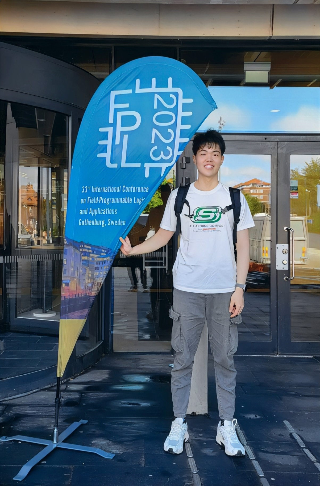

# About Me

 

Here is **Yang Adrian Liu (柳扬)**.

I am a second year M.E. student majoring in **Electronics Science and Technology** in the School of Microelectronics at **Fudan University**. Currently, I serve as a research assistant at the State Key Laboratory of ASIC and System, advised by [Prof. Jun Yu](https://sme.fudan.edu.cn/60/5e/c31157a352350/page.htm) and [Prof. Kun Wang](http://eda.ee.ucla.edu/people/kun-wang/index.html). 

If you are interested in any aspect of me, I would love to chat and collaborate, please email me at - *yang_liu22@m.fudan.edu.cn*

## Academic Background

**[Highlight] I am looking for PhD to start in 2025 Fall. Contact me if you have any leads!**

- **Sep. 2022 - June 2025 (expected):** Fudan University, Shanghai (M.E.)
- **Sep. 2018 - June 2022:** Fudan University, Shanghai (B.E.)

Expect to apply for a **Summer Research/Intern** program in 2024 and will graduate in June 2025. Looking for PhD position after that.

 

---

## Research Interests - EECS

- Design Automation
- Architecture Modeling and DSE
- Hardware Accelerator
- High-Level Synthesis (HLS)

My current research focuses on **design automation** that enables agile hardware accelerator design, particularly in the field of **artificial intelligence**. In a word, as AI models continue to grow in size, I aim to contribute my talents to bridge the gap between automation tools and expert-designed hardware.

 

---

## News and Updates

- **Dec. 2023：**Happy to be awarded the Fudan University Graduate Student Excellence Scholarship (**First Prize**).
- **Sep. 2023：** Gave a poster presentation on "DIF-LUT: A Simple Yet Scalable Approximation for Non-linear Activation Function on FPGA" at [FPL 2023, Gothenburg](https://2023.fpl.org/).
- **May 2023：**Our paper is accepted to FPL 2023, see you in Sweden.
- **Dec. 2022：**Happy to be awarded the Fudan University Freshman Scholarship for Graduate Students.
- **June 2022：**Happy to be awarded the **Shanghai Outstanding Graduates** (Undergraduate).
- **May 2022：**Happy to be awarded the Fudan University Undergraduate Student Excellence Scholarship (**First Prize**).
- **Feb. 2022：**Our team (*fmsh*) won the **fifth place** in [2021AIWIN Fall - ECG Diagnosis Track](http://aiwin.org.cn/competitions/64).
- **Feb. 2022：**Start my research studies in State Key Laboratory of ASIC and System in Fudan University.
- **Nov. 2021：**Our team (*fmsh*) won the **Grand Prize** in [Shanghai Urban Digital Transformation Intelligent Algorithm Competition](http://aiwin.org.cn/competitions/60).
- **July. 2021：**Started my IC intern at Intelligence Computing Lab in Shanghai Fudan Microelectronics Group Co., Ltd.
- **Dec. 2020：**Happy to be awarded the **Shanghai Municipal Scholarship**.

 
